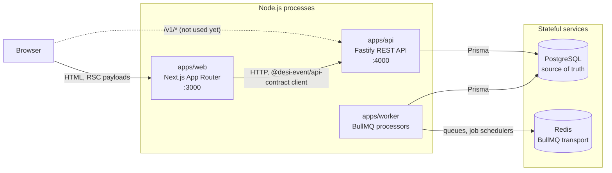
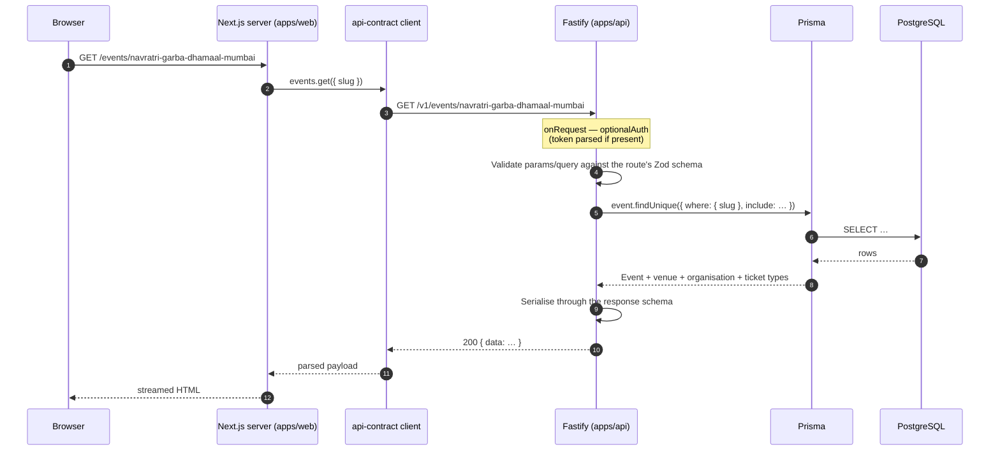
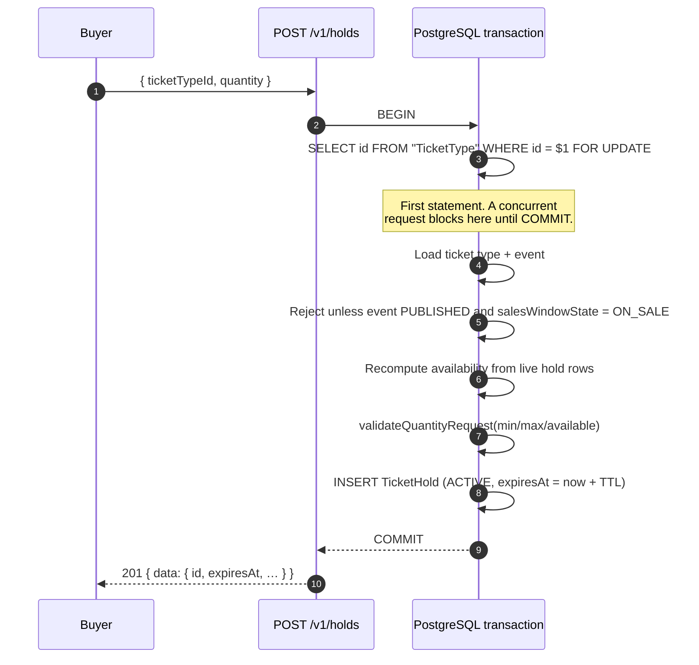
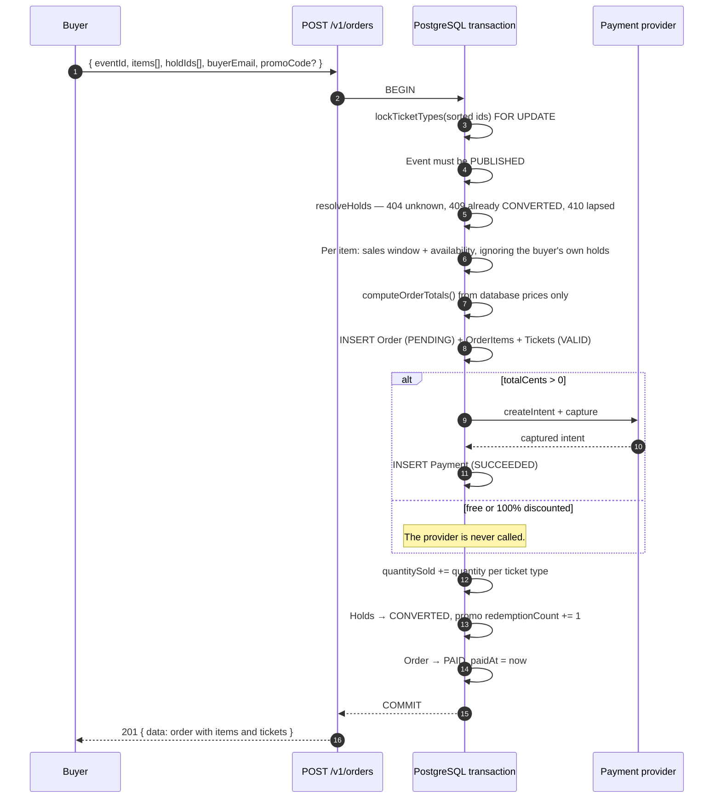
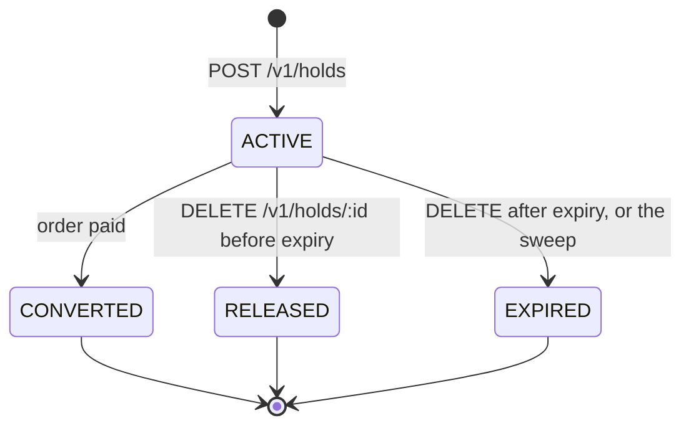
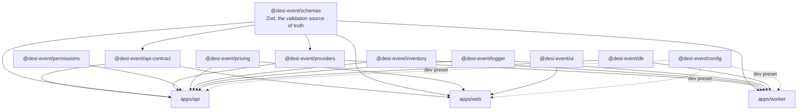
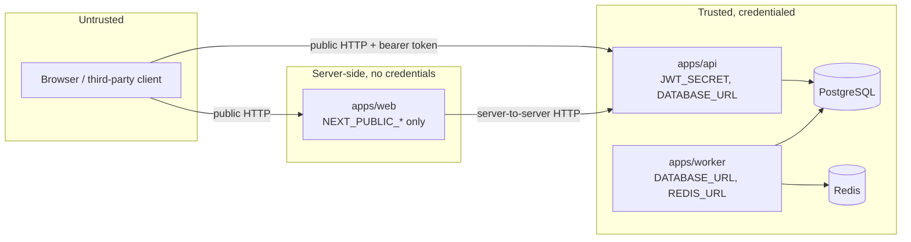

# Architecture

How Desi-Event is put together, and why. This describes what is in the
repository today; where something is deliberately unfinished it says so.

## The shape of the system

Three Node.js processes, one PostgreSQL database, one Redis instance, and ten
shared packages that all three processes import from.



Every arrow above is HTTP or a database protocol. Nothing shares memory, and
nothing but Prisma talks SQL.

**`apps/web`** renders the attendee-facing site. Pages are React Server
Components that fetch on the server through the generated client, so a visitor
never holds an API token and the browser never learns the API's shape. Reads
fail soft: when the API is unreachable, `src/lib/api.js` catches, warns once on
the server and renders a bundled sample catalogue with a visible notice, which
is why the site is browsable on a fresh clone with no API running at all.
Writes never fall back.

**`apps/api`** is the only writer. It owns authentication, authorization,
inventory, pricing and checkout. Every route is registered from a descriptor in
`@desi-event/api-contract`, which is also what generates the OpenAPI document,
so the published contract and the enforced contract are the same artefact.

**`apps/worker`** consumes four BullMQ queues. The one that matters to
correctness is the hold sweep; the rest are transactional email, ticket
issuance and search indexing.

## A request, end to end

A visitor opening an event page:



Inside Fastify, a request passes through a fixed pipeline, assembled in
`apps/api/src/app.js`:

| Stage | Plugin | What it does |
| --- | --- | --- |
| 1 | `plugins/validation` | Compiles Zod schemas into Fastify validators and serialisers |
| 2 | `plugins/error-handler` | One exit point; every failure leaves as the same envelope |
| 3 | `plugins/security` | Helmet headers, CORS from `CORS_ORIGIN` |
| 4 | `plugins/rate-limit` | 300 requests/minute globally, 10/minute on credentials |
| 5 | `plugins/auth` | JWT verification, then actor loading from the database |
| 6 | `plugins/docs` | `/docs` (Swagger UI) and `/openapi.json` |
| 7 | `routes/*` | Handlers, attached to contract descriptors by id |

Two details are load-bearing. The auth guard runs as an `onRequest` hook rather
than a `preHandler`, so an anonymous caller gets a 401 before the body is
parsed and cannot learn a protected endpoint's shape from its 400s. And the JWT
payload carries only identity — never memberships — so an organiser demoted
this morning loses access this morning, not when their seven-day token lapses.

## Where Redis and BullMQ sit

Redis is the queue transport and nothing else today. Being precise about that
matters more than the diagram:

* **The worker** opens the only Redis connection in the system. It creates four
  queues (`email`, `holds`, `tickets`, `search`), one `Worker` per queue, and
  upserts a job scheduler that enqueues an `expire-holds` job every
  `EXPIRE_HOLDS_INTERVAL_MS` (30 seconds by default).
* **The API does not currently talk to Redis.** `buildApp()` accepts an
  optional ioredis-compatible client for the `/health` probe, but `server.js`
  injects none, so `GET /health` reports `checks.database` only. Rate limiting
  is `@fastify/rate-limit`'s in-process store, which means the budgets above
  are per instance rather than per cluster. Both are deliberate for a
  single-instance deployment and both are the first things to change when a
  second instance appears.
* **The only wired producer is the worker's own scheduler.** `enqueueSendEmail`,
  `enqueueIssueTickets` and `enqueueIndexEvent` are implemented, validated and
  tested, but nothing in `apps/api` calls them yet: `orders.create` mints
  tickets inline inside the checkout transaction. The `issue-tickets` processor
  exists and is idempotent so that moving ticket minting out of the request
  path is a wiring change rather than a redesign.

Queue policy lives in `apps/worker/src/queues.js` and each deviation from the
default is a statement about what failure means for that queue: email retries
five times because SMTP providers blip, ticket issuance retries eight times and
keeps a month of history because a buyer has paid and has no tickets until it
succeeds, the hold sweep retries three times because a missed sweep is picked
up whole by the next one a minute later.

## Checkout and the hold lifecycle

This is the most important flow in the product and the one place where a bug
costs real money. It has two halves: taking a hold, and converting holds into a
paid order.

### Why holds exist

A buyer needs a few minutes between choosing tickets and finishing checkout. If
inventory is only decremented at payment, two buyers can both be told there is
one ticket left and both can pay for it. A `TicketHold` row reserves the stock
for the duration of the checkout, without pretending a sale has happened.

Holds never touch `TicketType.quantitySold`. Availability is computed:

```
availableQuantity = quantityTotal − quantitySold − activeHeldQuantity(holds, now)
```

`activeHeldQuantity` filters on `expiresAt` at read time rather than trusting
the `status` column, so a hold that lapsed thirty seconds ago is already back
on sale even though no sweeper has touched the row yet.

### Taking a hold



### How overselling is prevented

The naive implementation reads the counters, decides there is room, and then
inserts — a check-then-act race in which two requests both see one ticket left
and both succeed.

The fix is a PostgreSQL row lock taken as the **first** statement of the
transaction: `SELECT id FROM "TicketType" WHERE id = $1 FOR UPDATE`. Exactly
one transaction is granted it; the second blocks inside that `SELECT` until the
first commits, then reads the hold the winner just inserted, recomputes
availability including it, and is refused with `INSUFFICIENT_INVENTORY`.

Three properties make the argument hold, and all three are enforced in
`apps/api/src/lib/inventory.js`:

1. **The lock is taken before any counter is read.** Locking after the read
   serialises the writes but not the decision, which is the bug.
2. **Availability is always recomputed from live rows inside the
   transaction** — never carried in from a read taken before the lock.
3. **Multi-tier orders lock ids in sorted order**, so two transactions touching
   the same pair of ticket types cannot each hold half of what the other needs
   and deadlock.

### Converting holds into an order



Three rules this endpoint never breaks:

* **Prices are never taken from the request.** Only `ticketTypeId` and
  `quantity` are trusted; every amount is recomputed by `@desi-event/pricing`
  from the ticket type rows, in integer cents.
* **Availability is re-checked under the lock**, because a hold may have lapsed
  between the cart and the card. The buyer's own holds are excluded from the
  held total so their reservation is not counted against the very request it
  exists to protect.
* **Nothing survives a failed payment.** Order, items, tickets, the sold
  counter and the hold conversions are written inside one transaction that the
  payment call runs inside. A decline throws, the transaction rolls back, and
  the database looks exactly as it did before the attempt.

Holding a transaction open across a provider round-trip is a real cost — a row
lock held for the duration — accepted deliberately in exchange for never
writing a captured payment and its tickets apart.

### Known limitation: payment happens inside the transaction

The capture call to the payment provider sits inside the checkout transaction.
That is what makes a declined card leave nothing behind — the order, its items,
the tickets and the `quantitySold` increment all roll back together — but it
also means an external network call is made while database locks are held.

Prisma's default interactive-transaction timeout is five seconds. The in-memory
provider answers instantly, so this is invisible today; the transaction is
configured with a wider window (`ORDER_TRANSACTION_OPTIONS` in
`apps/api/src/routes/orders.js`) to buy headroom. A real gateway that exceeded
it would be the worst kind of failure: the money taken, the surrounding
transaction rolled back, and a charge with no tickets against it.

**Before a production payment gateway is wired up, checkout must move to a
two-phase flow:**

1. Persist a `PENDING` order and its items in one transaction, holding the
   inventory that is already reserved.
2. Capture the payment with no transaction open and no locks held.
3. Settle in a second transaction — mark the order `PAID`, issue tickets,
   convert the holds — or compensate by cancelling the order and releasing the
   holds if the capture failed or timed out.

Step 3 has to be idempotent and safe to retry, because the process can die
between steps 2 and 3. The `Payment` row keyed on `(provider, providerRef)` is
the natural place to anchor that: a retry that finds a succeeded payment
settles the order rather than charging again.

### The hold state machine



`DELETE /v1/holds/:id` is idempotent: a hold that already lapsed or was already
released reports success, because a checkout page unmounting twice must not
raise an error. Only a hold already converted into a paid order answers 409.

### How abandoned holds are reclaimed

Most buyers close the tab. Nothing in the request path ever runs again for
those rows, so without a sweeper every abandoned checkout would leave an
`ACTIVE` hold behind and a popular event would show "sold out" with seats
nobody paid for.

Reclamation happens on two timescales:

1. **Immediately, at read time.** `activeHeldQuantity(holds, now)` ignores any
   hold whose `expiresAt` has passed, so availability is correct the instant a
   hold lapses. This is what keeps buyers honest-to-the-second; the sweep is
   not on the critical path.
2. **Within a sweep interval, in the table.** The worker's job scheduler
   enqueues `expire-holds` every 30 seconds. The processor selects `ACTIVE`
   holds oldest first (using the `@@index([status, expiresAt])`), asks
   `partitionExpiredHolds` from `@desi-event/inventory` which of them have
   actually lapsed, and flips those to `EXPIRED` with a
   `where: { status: ACTIVE }` guard so the write is idempotent and safe to run
   alongside the API's own release endpoint.

The query deliberately does **not** filter on `expiresAt` in SQL. Expiry is
defined once, in `partitionExpiredHolds`, and the read path already depends on
that definition; two copies of the rule — one in SQL, one in JavaScript — is
how a boundary condition like `expiresAt === now` ends up being decided
differently by the sweeper and by the availability calculation.

Because holds never incremented `quantitySold`, "releasing inventory" is
nothing more than flipping the status. There is no counter to decrement and no
compensating write that can go wrong.

## Shared package graph



The graph is deliberately shallow. `schemas` depends on nothing but Zod;
`permissions`, `pricing` and `inventory` depend on nothing at all. That is what
lets the expensive logic — money, availability, authorization — be tested as
pure functions with no database, no clock and no network, and it is why those
three packages carry coverage thresholds.

Two rules keep it that way:

* **Nothing but `apps/api` and `apps/worker` imports `@desi-event/db`.** The web
  app has no database credentials and no Prisma client; it reaches data only
  through the API.
* **Nothing hard-codes a URL.** `apps/web` calls `createApiClient()` from
  `@desi-event/api-contract`, so a renamed path is a compile-free but
  test-visible change in exactly one file.

## Trust boundaries



Four boundaries, and what is checked at each:

| Boundary | Crossing | Enforcement |
| --- | --- | --- |
| Browser → API | Untrusted input | Every param, query and body is parsed by a Zod schema from the route descriptor before a handler sees it. Responses are serialised through their schema too, so a handler cannot leak a field the contract does not declare |
| Anonymous → authenticated | Bearer JWT | `app.authenticate` verifies the signature, then re-loads the user and memberships from the database on every request |
| Authenticated → authorized | Capability check | `assertCan(actor, capability, { organizationId })` from `@desi-event/permissions`. No route compares a role itself |
| Producer → worker | Queue payload | Job payloads are validated twice, by the producer (`validateJobPayload`) and again by the processor (`parseJobPayload`), because the two catch different bugs |

Supporting rules:

* Money never crosses a boundary as a client-supplied amount. Prices come from
  the database; totals come from `@desi-event/pricing`.
* Environment variables are parsed at boot through `apiEnvSchema`,
  `workerEnvSchema` or `webEnvSchema`, so a misconfiguration is an immediate
  crash naming the variable rather than a confusing failure later.
* `JWT_SECRET` must be at least 32 characters, and the schema refuses known
  placeholder values when `NODE_ENV=production`.
* Sign-in answers 401 identically for a wrong password and an unknown email,
  and hashes against a dummy bcrypt hash in the unknown-email case so the two
  take the same time. The endpoint cannot be used to enumerate accounts.
* 5xx bodies in production carry a fixed message; internal detail is logged,
  never sent.
* The error handler is the single exit point, so nothing reaches a client
  outside the `errorResponseSchema` envelope.

## Phase 3: mobile

React Native with Expo is planned and **not yet scaffolded**. There is no
`apps/mobile` directory, and nothing in the repository imports Expo today.

When it lands, it is a fourth consumer of the same packages rather than a
second implementation of the product:

* `@desi-event/schemas` — the same Zod schemas validating the same payloads.
* `@desi-event/pricing` — the same integer-cent totals, so a basket cannot show
  one price on a phone and another on the web.
* `@desi-event/permissions` — the same capability checks deciding which
  organiser tools appear.
* `@desi-event/api-contract` — the same generated client against the same
  routes, which is what makes a new endpoint reach mobile without anybody
  hand-writing a URL.

What will not be shared is `@desi-event/ui`, which is DOM React styled with
Tailwind; React Native needs its own primitives against the same design tokens.
The obvious first screen is door check-in — `POST /v1/tickets/check-in` already
exists, is idempotent on re-scan, and is exactly the workflow a phone is better
at than a laptop.

The language policy applies unchanged: Expo, JSX, no TypeScript. Anything
native that React Native genuinely cannot reach — a Kotlin or Swift module —
needs an entry in `docs/language-exceptions.json` before it merges.
