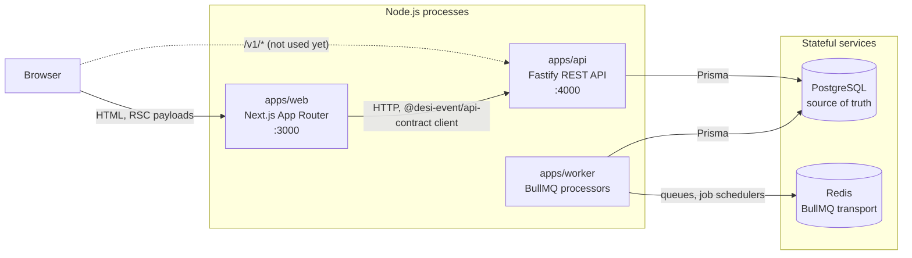
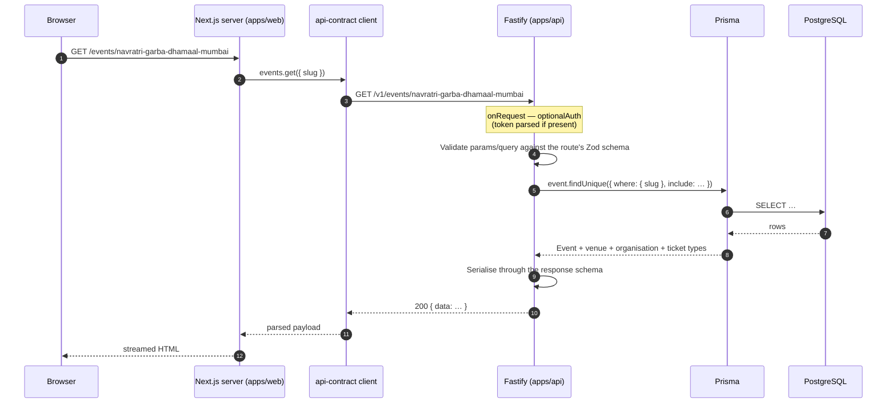
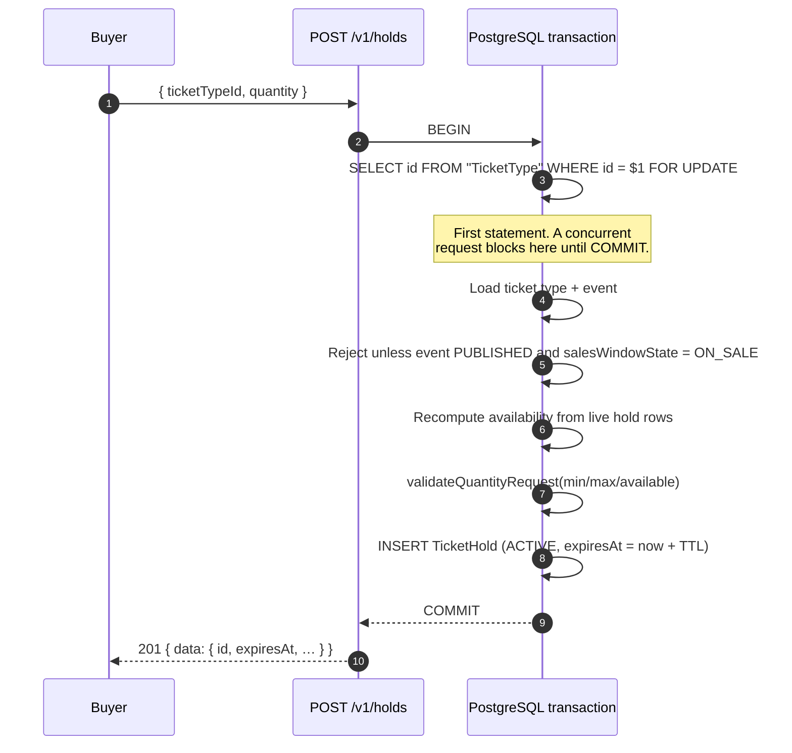
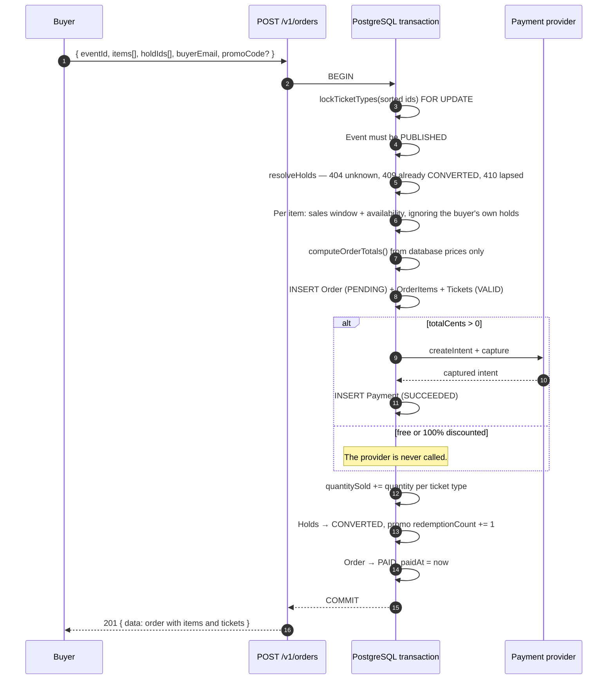
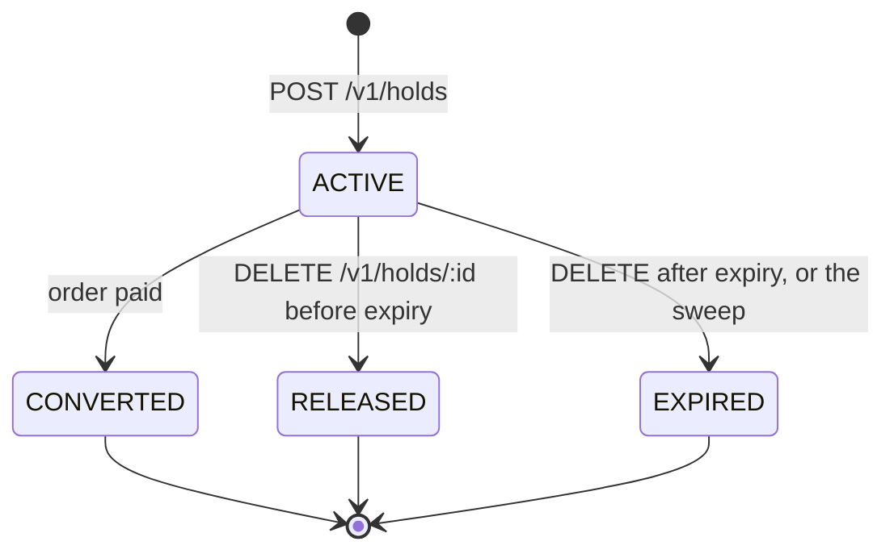
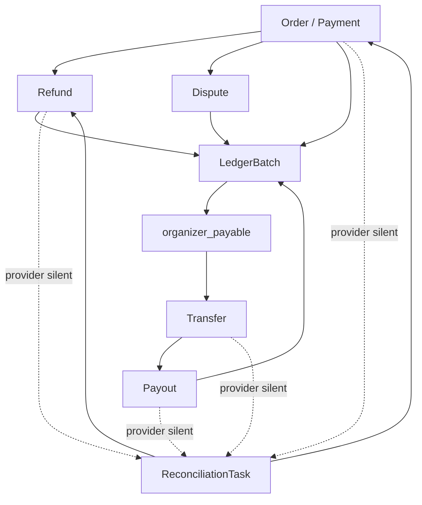
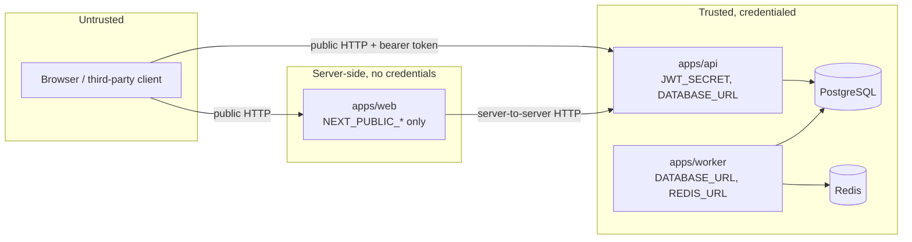

# Architecture

How Desi-Event is put together, and why. This describes what is in the
repository today; where something is deliberately unfinished it says so.

## The shape of the system

Three Node.js processes, one PostgreSQL database, one Redis instance, and ten
shared packages that all three processes import from.



Every arrow above is HTTP or a database protocol. Nothing shares memory, and
nothing but Prisma talks SQL.

**`apps/web`** renders the attendee-facing site. Pages are React Server
Components that fetch on the server through the generated client, so a visitor
never holds an API token and the browser never learns the API's shape. Reads
fail soft: when the API is unreachable, `src/lib/api.js` catches, warns once on
the server and renders a bundled sample catalogue with a visible notice, which
is why the site is browsable on a fresh clone with no API running at all.
Writes never fall back.

**`apps/api`** is the only writer. It owns authentication, authorization,
inventory, pricing and checkout. Every route is registered from a descriptor in
`@desi-event/api-contract`, which is also what generates the OpenAPI document,
so the published contract and the enforced contract are the same artefact.

**`apps/worker`** consumes four BullMQ queues. The one that matters to
correctness is the hold sweep; the rest are transactional email, ticket
issuance and search indexing.

## A request, end to end

A visitor opening an event page:



Inside Fastify, a request passes through a fixed pipeline, assembled in
`apps/api/src/app.js`:

| Stage | Plugin                  | What it does                                                 |
| ----- | ----------------------- | ------------------------------------------------------------ |
| 1     | `plugins/validation`    | Compiles Zod schemas into Fastify validators and serialisers |
| 2     | `plugins/error-handler` | One exit point; every failure leaves as the same envelope    |
| 3     | `plugins/security`      | Helmet headers, CORS from `CORS_ORIGIN`                      |
| 4     | `plugins/rate-limit`    | 300 requests/minute globally, 10/minute on credentials       |
| 5     | `plugins/auth`          | JWT verification, then actor loading from the database       |
| 6     | `plugins/docs`          | `/docs` (Swagger UI) and `/openapi.json`                     |
| 7     | `routes/*`              | Handlers, attached to contract descriptors by id             |

Two details are load-bearing. The auth guard runs as an `onRequest` hook rather
than a `preHandler`, so an anonymous caller gets a 401 before the body is
parsed and cannot learn a protected endpoint's shape from its 400s. And the JWT
payload carries only identity — never memberships — so an organiser demoted
this morning loses access this morning, not when their seven-day token lapses.

## Where Redis and BullMQ sit

Redis is the queue transport and nothing else today. Being precise about that
matters more than the diagram:

- **The worker** opens the only Redis connection in the system. It creates four
  queues (`email`, `holds`, `tickets`, `search`), one `Worker` per queue, and
  upserts a job scheduler that enqueues an `expire-holds` job every
  `EXPIRE_HOLDS_INTERVAL_MS` (30 seconds by default).
- **The API does not currently talk to Redis.** `buildApp()` accepts an
  optional ioredis-compatible client for the `/health` probe, but `server.js`
  injects none, so `GET /health` reports `checks.database` only. Rate limiting
  is `@fastify/rate-limit`'s in-process store, which means the budgets above
  are per instance rather than per cluster. Both are deliberate for a
  single-instance deployment and both are the first things to change when a
  second instance appears.
- **The only wired producer is the worker's own scheduler.** `enqueueSendEmail`,
  `enqueueIssueTickets` and `enqueueIndexEvent` are implemented, validated and
  tested, but nothing in `apps/api` calls them yet: `orders.create` mints
  tickets inline inside the checkout transaction. The `issue-tickets` processor
  exists and is idempotent so that moving ticket minting out of the request
  path is a wiring change rather than a redesign.

Queue policy lives in `apps/worker/src/queues.js` and each deviation from the
default is a statement about what failure means for that queue: email retries
five times because SMTP providers blip, ticket issuance retries eight times and
keeps a month of history because a buyer has paid and has no tickets until it
succeeds, the hold sweep retries three times because a missed sweep is picked
up whole by the next one a minute later.

## Checkout and the hold lifecycle

This is the most important flow in the product and the one place where a bug
costs real money. It has two halves: taking a hold, and converting holds into a
paid order.

### Why holds exist

A buyer needs a few minutes between choosing tickets and finishing checkout. If
inventory is only decremented at payment, two buyers can both be told there is
one ticket left and both can pay for it. A `TicketHold` row reserves the stock
for the duration of the checkout, without pretending a sale has happened.

Holds never touch `TicketType.quantitySold`. Availability is computed:

```
availableQuantity = quantityTotal − quantitySold − activeHeldQuantity(holds, now)
```

`activeHeldQuantity` filters on `expiresAt` at read time rather than trusting
the `status` column, so a hold that lapsed thirty seconds ago is already back
on sale even though no sweeper has touched the row yet.

### Taking a hold



### How overselling is prevented

The naive implementation reads the counters, decides there is room, and then
inserts — a check-then-act race in which two requests both see one ticket left
and both succeed.

The fix is a PostgreSQL row lock taken as the **first** statement of the
transaction: `SELECT id FROM "TicketType" WHERE id = $1 FOR UPDATE`. Exactly
one transaction is granted it; the second blocks inside that `SELECT` until the
first commits, then reads the hold the winner just inserted, recomputes
availability including it, and is refused with `INSUFFICIENT_INVENTORY`.

Three properties make the argument hold, and all three are enforced in
`apps/api/src/lib/inventory.js`:

1. **The lock is taken before any counter is read.** Locking after the read
   serialises the writes but not the decision, which is the bug.
2. **Availability is always recomputed from live rows inside the
   transaction** — never carried in from a read taken before the lock.
3. **Multi-tier orders lock ids in sorted order**, so two transactions touching
   the same pair of ticket types cannot each hold half of what the other needs
   and deadlock.

### Converting holds into an order



Three rules this endpoint never breaks:

- **Prices are never taken from the request.** Only `ticketTypeId` and
  `quantity` are trusted; every amount is recomputed by `@desi-event/pricing`
  from the ticket type rows, in integer cents.
- **Availability is re-checked under the lock**, because a hold may have lapsed
  between the cart and the card. The buyer's own holds are excluded from the
  held total so their reservation is not counted against the very request it
  exists to protect.
- **Nothing survives a failed payment.** Order, items, tickets, the sold
  counter and the hold conversions are written inside one transaction that the
  payment call runs inside. A decline throws, the transaction rolls back, and
  the database looks exactly as it did before the attempt.

Holding a transaction open across a provider round-trip is a real cost — a row
lock held for the duration — accepted deliberately in exchange for never
writing a captured payment and its tickets apart.

### Checkout is two-phase, and the boundary is the point

**No call to a payment provider ever happens while a database transaction is
open.** Holding locks across a network call to a third party couples this
system's availability to theirs, and the failure it produces is the worst one a
ticketing system has: the gateway is merely slow, the transaction times out and
rolls back, and the money has still moved — a charge with no order and no
tickets against it.

So checkout is three steps:

1. **Begin** (transaction). Validate the cart, lock the tiers, price the order,
   reserve inventory, and write a `PENDING` order with an `INITIATED` payment
   attempt. Commit. After this returns, durable evidence exists that a charge is
   about to be attempted — which is what makes a process that dies mid-call
   recoverable rather than invisible.
2. **Capture** (no transaction). Call the provider. However long it takes, no
   locks are held and nothing can time out underneath it.
3. **Settle or compensate** (short transaction). Record the outcome.

Inventory stays reserved for the whole of step 2. Any quantity not already
covered by a buyer's hold gets one created for it in step 1, so nothing in the
cart is purchasable by somebody else while the card is authorising.

#### Three outcomes, three paths

| Provider says     | Order                  | Payment                             | Inventory                                             |
| ----------------- | ---------------------- | ----------------------------------- | ----------------------------------------------------- |
| Captured          | `PAID`, tickets issued | `SUCCEEDED`                         | `quantitySold` incremented, holds `CONVERTED`         |
| Declined          | `CANCELLED`            | `FAILED` with the decline code      | Untouched; holds stay `ACTIVE` so the buyer can retry |
| Nothing (timeout) | stays `PENDING`        | `TIMEOUT`, `reconciliationRequired` | Stays reserved                                        |

A timeout is not a decline. A decline means no money moved; a timeout means
nobody knows. Cancelling an order whose charge may have succeeded either strands
a buyer who paid or refunds money that was never taken, so the ambiguous case is
left for reconciliation rather than guessed at.

#### The webhook is authoritative

Fulfilment is driven by the provider's callback, not by the browser redirect. A
redirect is a message from the buyer's user agent: it can be closed before it
arrives, replayed from history, or forged. `WebhookEvent` records every delivery
against a unique `(provider, providerEventId)`, so a duplicate delivery is
acknowledged and changes nothing.

Settlement is a conditional update — `WHERE status = 'PENDING'` — which is what
stops two workers from fulfilling one payment. Whether the second arrival is a
duplicate webhook, a retry, or the synchronous checkout path racing the
callback, it finds the order already `PAID` and does nothing. There is exactly
one set of tickets, one inventory decrement and one audit row per order.

A retried checkout carrying the same `Idempotency-Key` resolves to the original
order instead of creating and charging a second one; the unique index on
`Order.idempotencyKey` is the real guarantee.

#### Phase 1 scope

The provider is the deterministic in-memory mock. Real payment credentials are
not configured and real payment activation remains out of scope for Phase 1;
the flow above is exercised against the mock's success, decline, timeout,
duplicate-webhook, delayed-webhook and retry scenarios. Before a live gateway is
connected, the webhook endpoint needs provider signature verification, which the
mock does not model.

### The hold state machine



`DELETE /v1/holds/:id` is idempotent: a hold that already lapsed or was already
released reports success, because a checkout page unmounting twice must not
raise an error. Only a hold already converted into a paid order answers 409.

### How abandoned holds are reclaimed

Most buyers close the tab. Nothing in the request path ever runs again for
those rows, so without a sweeper every abandoned checkout would leave an
`ACTIVE` hold behind and a popular event would show "sold out" with seats
nobody paid for.

Reclamation happens on two timescales:

1. **Immediately, at read time.** `activeHeldQuantity(holds, now)` ignores any
   hold whose `expiresAt` has passed, so availability is correct the instant a
   hold lapses. This is what keeps buyers honest-to-the-second; the sweep is
   not on the critical path.
2. **Within a sweep interval, in the table.** The worker's job scheduler
   enqueues `expire-holds` every 30 seconds. The processor selects `ACTIVE`
   holds oldest first (using the `@@index([status, expiresAt])`), asks
   `partitionExpiredHolds` from `@desi-event/inventory` which of them have
   actually lapsed, and flips those to `EXPIRED` with a
   `where: { status: ACTIVE }` guard so the write is idempotent and safe to run
   alongside the API's own release endpoint.

The query deliberately does **not** filter on `expiresAt` in SQL. Expiry is
defined once, in `partitionExpiredHolds`, and the read path already depends on
that definition; two copies of the rule — one in SQL, one in JavaScript — is
how a boundary condition like `expiresAt === now` ends up being decided
differently by the sweeper and by the availability calculation.

Because holds never incremented `quantitySold`, "releasing inventory" is
nothing more than flipping the status. There is no counter to decrement and no
compensating write that can go wrong.

## Shared package graph

```mermaid
flowchart TD
  schemas["@desi-event/schemas<br/>Zod, the validation source of truth"]
  contract["@desi-event/api-contract"]
  providers["@desi-event/providers"]
  permissions["@desi-event/permissions"]
  pricing["@desi-event/pricing"]
  inventory["@desi-event/inventory"]
  ledger["@desi-event/ledger"]
  auth["@desi-event/auth"]
  notifications["@desi-event/notifications"]
  logger["@desi-event/logger"]
  db["@desi-event/db"]
  ui["@desi-event/ui"]
  config["@desi-event/config"]

  api["apps/api"]
  web["apps/web"]
  worker["apps/worker"]

  schemas --> contract
  schemas --> providers

  contract --> api
  contract --> web
  schemas --> api
  schemas --> web
  schemas --> worker
  providers --> api
  providers --> worker
  permissions --> api
  pricing --> api
  pricing --> web
  inventory --> api
  inventory --> worker
  ledger --> api
  auth --> api
  notifications --> api
  notifications --> worker
  logger --> api
  logger --> worker
  db --> api
  db --> worker
  ui --> web

  config -.->|dev preset| api
  config -.->|dev preset| web
  config -.->|dev preset| worker
```



The graph is deliberately shallow. `schemas` depends on nothing but Zod;
`permissions`, `pricing`, `inventory` and `ledger` depend on nothing at all.
That is what lets the expensive logic — money, availability, authorization,
double-entry accounting — be tested as pure functions with no database, no clock
and no network, and it is why those packages carry coverage thresholds.

`@desi-event/ledger` is a late addition and follows the same rule: it knows the
chart of accounts and what each event posts, and it knows nothing about Prisma.
Writing a batch is `apps/api/src/lib/ledger.js`; deciding what the batch _is_
is a pure function.

Two rules keep it that way:

- **Nothing but `apps/api` and `apps/worker` imports `@desi-event/db`.** The web
  app has no database credentials and no Prisma client; it reaches data only
  through the API.
- **Nothing hard-codes a URL.** `apps/web` calls `createApiClient()` from
  `@desi-event/api-contract`, so a renamed path is a compile-free but
  test-visible change in exactly one file.

## The money subsystems

Phase 2 added five subsystems that all share one shape, and the shape is the
architecture: **a state machine whose every transition is a conditional
`UPDATE`, a provider call that happens with no transaction open, and a ledger
batch posted in a short transaction afterwards.**



Three properties hold across all five, and each is the answer to a specific way
this goes wrong:

**A provider is never called inside a database transaction.** A network call
inside a transaction is a row lock held for as long as somebody else's server
takes to answer. Every one of these is written as reserve-and-commit → call →
record, and the middle step holds nothing.

**Every dotted edge goes to reconciliation, never to failure.** A provider that
does not answer has not said no. Silence becomes its own state and a work item,
because reading it as failure cancels things people paid for and reading it as
success gives away things nobody paid for.

**Money is derived from the ledger.** `Order.totalCents` is written once at
checkout and never corrected; summing it produces a number that looks like
revenue and is not one. Every figure on the finance surface comes from
`LedgerEntry`, and the finance screen shows the ledger's own integrity check
_above_ the totals. The analytics surface calls the _same_ `financeSummary`
rather than deriving its own, so two screens cannot come to two different
answers about what an organisation is owed — two derivations of one question
eventually disagree, and the disagreement surfaces as a support ticket rather
than as a test failure.

**Counts and money are different measurements and stay in different branches.**
`analytics.js` counts tickets from `Ticket`, seats from `EventSeat`, admissions
from `CheckIn` and remaining stock from the same counter the selling path
guards. None of those is money, and the field carrying what an order line was
priced at is called `lineValueCents` rather than "revenue" for exactly that
reason: "tickets sold × face value" is not what the organisation keeps, and a
screen printing the two side by side invites somebody to reconcile two different
measurements.

The individual documents are `docs/PAYMENTS.md`, `docs/FINANCIAL_LEDGER.md`,
`docs/REFUNDS_DISPUTES.md`, `docs/STRIPE_CONNECT.md` and
`docs/RECONCILIATION_RUNBOOK.md`.

### The universal concurrency primitive

Nothing in this codebase reads a count and then writes one. Every contended
mutation is:

```js
const { count } = await tx.thing.updateMany({
  where: { id, status: theStatusItWasReadIn },
  data: { status: theNewStatus },
})
if (count !== 1) {
  /* somebody else got there first */
}
```

The affected-row count _is_ the race resolution. It is how inventory is taken,
how a refund is submitted, how a task is claimed, how a ticket is admitted, and
how a payout is sent — one primitive, so there is one thing to get right and one
thing to review.

### Where a trigger is used instead

When the invariant must hold for code that has not been written yet. 20 plpgsql
triggers, all in migrations under ADR 0004: ledger immutability and balance,
ticket status transitions, check-in admissibility, map version freezing, and the
cross-entity coherence rules that refuse a row whose foreign keys point at
different events.

`apps/api/src/lib/errors.js` exports `databaseErrorCode()` because **Prisma
nests a trigger's error**: the outer code is `P2039` and the real `P0001` is at
`error.meta.driverAdapterError.cause.originalCode`. Not unwrapping it turned a
trigger refusal into a 500 at a door.

## Trust boundaries



Four boundaries, and what is checked at each:

| Boundary                   | Crossing         | Enforcement                                                                                                                                                                                                                 |
| -------------------------- | ---------------- | --------------------------------------------------------------------------------------------------------------------------------------------------------------------------------------------------------------------------- |
| Browser → API              | Untrusted input  | Every param, query and body is parsed by a Zod schema from the route descriptor before a handler sees it. Responses are serialised through their schema too, so a handler cannot leak a field the contract does not declare |
| Anonymous → authenticated  | Bearer JWT       | `app.authenticate` verifies the signature, then re-loads the user and memberships from the database on every request                                                                                                        |
| Authenticated → authorized | Capability check | `assertCan(actor, capability, { organizationId })` from `@desi-event/permissions`. No route compares a role itself                                                                                                          |
| Producer → worker          | Queue payload    | Job payloads are validated twice, by the producer (`validateJobPayload`) and again by the processor (`parseJobPayload`), because the two catch different bugs                                                               |

Supporting rules:

- Money never crosses a boundary as a client-supplied amount. Prices come from
  the database; totals come from `@desi-event/pricing`.
- Environment variables are parsed at boot through `apiEnvSchema`,
  `workerEnvSchema` or `webEnvSchema`, so a misconfiguration is an immediate
  crash naming the variable rather than a confusing failure later.
- `JWT_SECRET` must be at least 32 characters, and the schema refuses known
  placeholder values when `NODE_ENV=production`.
- Sign-in answers 401 identically for a wrong password and an unknown email,
  and hashes against a dummy bcrypt hash in the unknown-email case so the two
  take the same time. The endpoint cannot be used to enumerate accounts.
- 5xx bodies in production carry a fixed message; internal detail is logged,
  never sent.
- The error handler is the single exit point, so nothing reaches a client
  outside the `errorResponseSchema` envelope.

## Phase 3: mobile

React Native with Expo is planned and **not yet scaffolded**. There is no
`apps/mobile` directory, and nothing in the repository imports Expo today.

When it lands, it is a fourth consumer of the same packages rather than a
second implementation of the product:

- `@desi-event/schemas` — the same Zod schemas validating the same payloads.
- `@desi-event/pricing` — the same integer-cent totals, so a basket cannot show
  one price on a phone and another on the web.
- `@desi-event/permissions` — the same capability checks deciding which
  organiser tools appear.
- `@desi-event/api-contract` — the same generated client against the same
  routes, which is what makes a new endpoint reach mobile without anybody
  hand-writing a URL.

What will not be shared is `@desi-event/ui`, which is DOM React styled with
Tailwind; React Native needs its own primitives against the same design tokens.
The obvious first screen is door check-in — `POST /v1/tickets/check-in` already
exists, is idempotent on re-scan, and is exactly the workflow a phone is better
at than a laptop.

The language policy applies unchanged: Expo, JSX, no TypeScript. Anything
native that React Native genuinely cannot reach — a Kotlin or Swift module —
needs an entry in `docs/language-exceptions.json` before it merges.
